# E-commerce Back End

## Licensing:

## Table of Contents 
- [Description](#description)
- [Installation](#installation)
- [Usage](#usage)
- [License](#license)
- [Contributing](#contributing)
- [Tests](#tests)
- [Questions](#questions)

## Description:
This is an e-commerce back-end database created in the UW Coding Bootcamp. This is a node command line application that utilizes sequilize, dotenv, and mysql2 to view, create, update, and delete data from the database using Insomnia.

## Installation:
- Download it through Github
- Ensure Insomnia is installed on your own computer
- Ensure express is installed
- Ensure mysql2 is installed
- Ensure sequelize is installed
- Ensure dotenv is installed
- To connect to the database, once files are downloaded to you computer, you will need to use the .env.EXAMPLE file to input your password and username for your mysql.  You'll also need to change the name of that file to .env

## Usage:

Link to Video of Walkthrough for Demonstration:

https://youtu.be/Oj_nnA2_WO0

- Open terminal and navigate to ecommerce_back_end folder
- Type npm init -y into terminal to create a new .json file
- Type npm i into terminal
- Type npm i express into terminal
- Type npm i mysql2 into terminal
- Type npm i sequelize into terminal
- Type npm i dotenv into terminal
- Navigate to the db folder
- Type mysql -u root -p into terminal
- Enter your password into terminal
- Type source schema.sql into terminal
- Type quit into terminal
- Navigate back to the the ecommerce_back_end in terminal
- Type node seeds/index.js so the seeds will populate the database
- Type npm start into the terminal
- Once you see the Now Listening indication you may open up your Insomnia software

Screenshots:
On the backend of the app, using Insomnia, the following routes have been created:

GET /api/categories

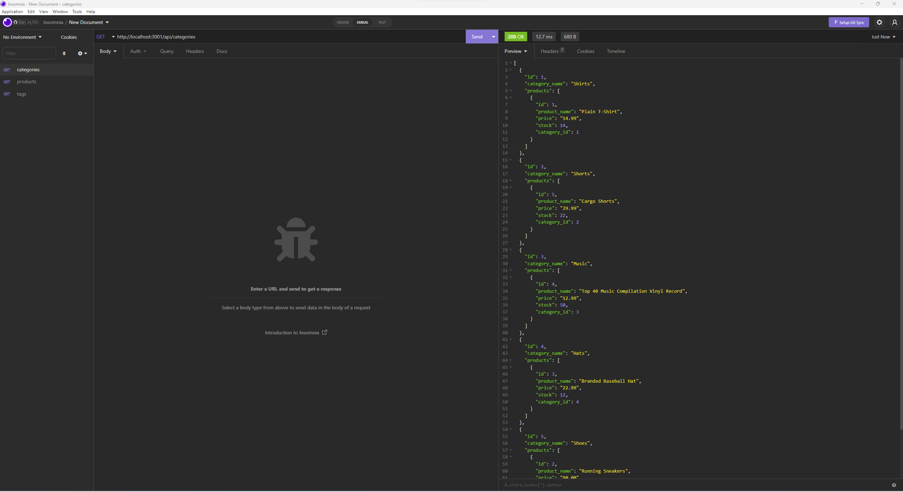

GET /api/products

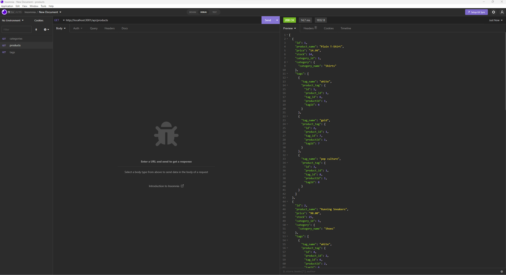

GET /api/tags

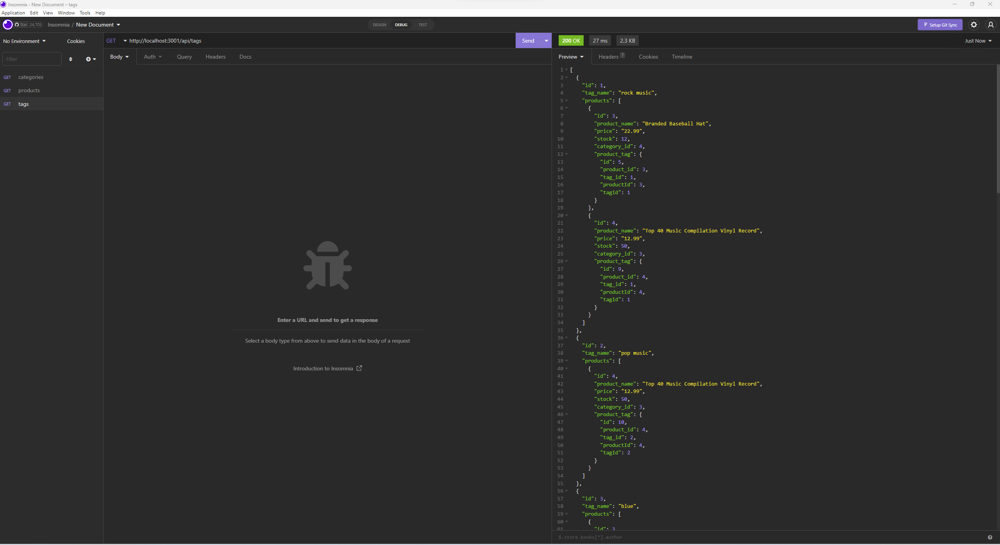

GET /api/categories/:id (put in actual id number there)

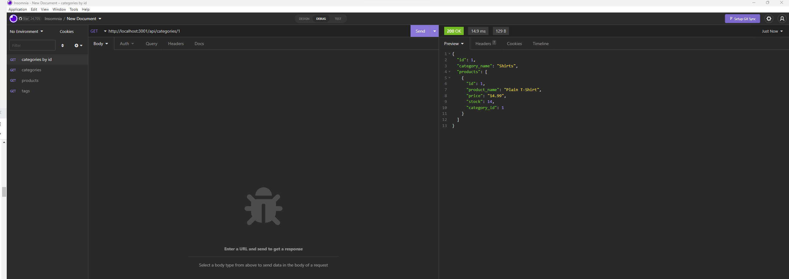

GET /api/products/:id (put in actual id number there)

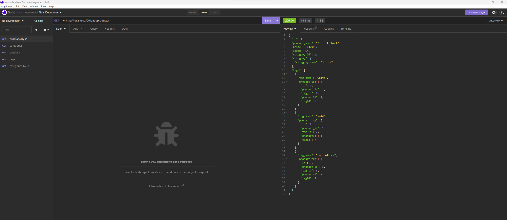

GET /api/tags/:id (put in actual id number there)

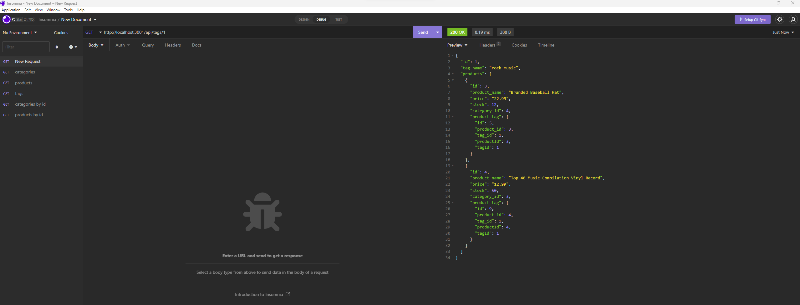

POST /api/categories/

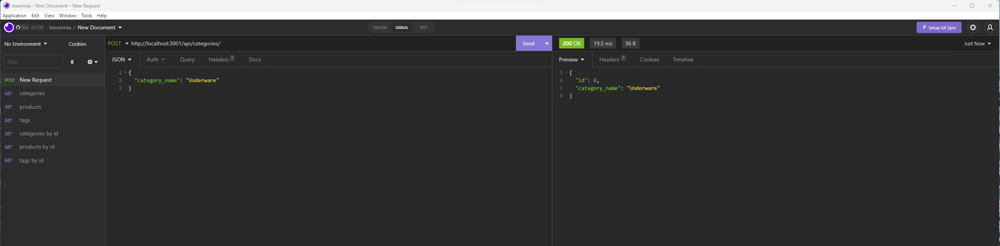

PUT /api/categories/:id (put in actual id number there)

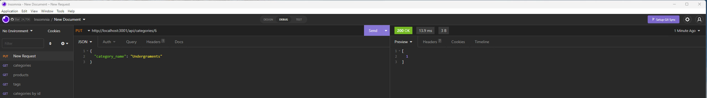

DELETE /api/categories/:id (put in actual id number there)

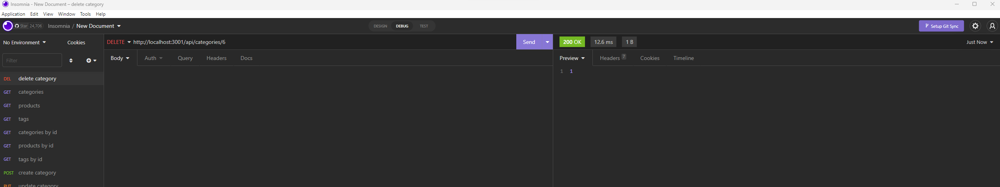

POST /api/products/

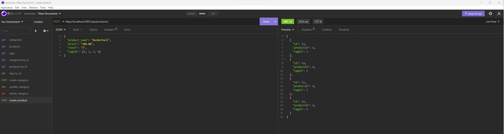

PUT /api/products/:id (put in actual id number there)

DELETE /api/products/:id (put in actual id number there)

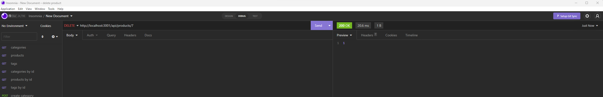

POST /api/tags/

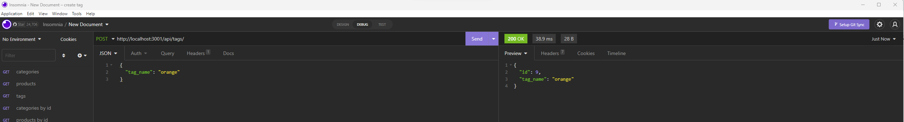

PUT /api/tags/:id (put in actual id number there)

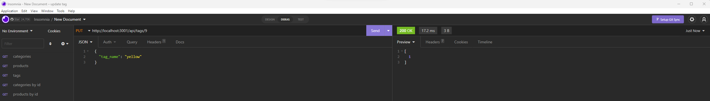

DELETE /api/tags/:id (put in actual id number there)

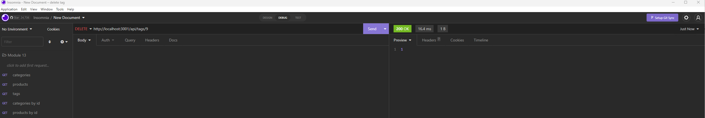

## License:
MIT

## Contributing:
There was already a starter code provided for this project here: https://github.com/coding-boot-camp/fantastic-umbrella (which is why your see contributors listed in the repo).

Contributions are welcome through forking my repository.

## Tests:
None

## Questions:
- Github: [andreahergert](https://github.com/andreahergert)
- Email: ahergert24@hotmail.com 